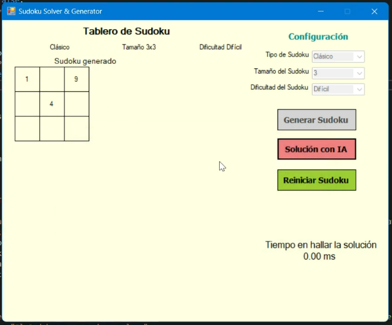
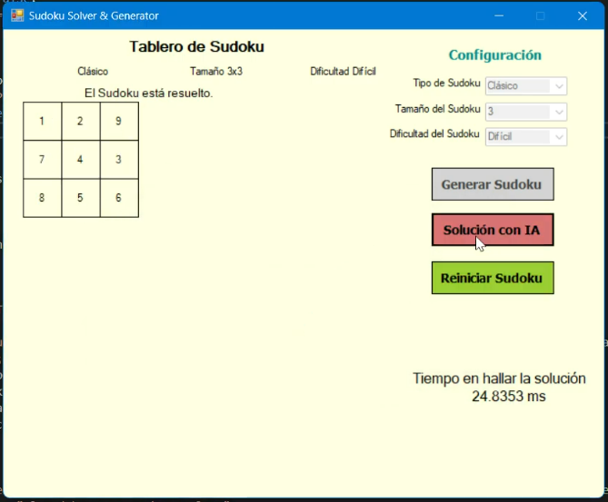

# 🧩 Sudoku Intelligent Backtracking Solver

[Español](https://www.google.com/search?q=%23espa%C3%B1ol) | [English](https://www.google.com/search?q=%23english)

---

## Español

### 📄 Descripción

Esta es una aplicación de escritorio desarrollada en **C#** utilizando  **Windows Forms (.NET Framework 4.7.2 - Runtime version 4.0)** . Su objetivo principal es generar y resolver rompecabezas de Sudoku de manera eficiente utilizando algoritmos de  **Backtracking Inteligente** .

El proyecto no solo permite jugar Sudoku clásicos, sino que también ofrece herramientas para visualizar la solución automática del tablero y configurar diferentes tipos de dificultades y tamaños.

### ✨ Características Principales

* **Generación Dinámica:** Crea tableros de Sudoku aleatorios y válidos cada vez.
* **Niveles de Dificultad:** Ajuste de celdas vacías basado en dificultad (Fácil, Medio, Difícil).
* **Algoritmo de Resolución:** Implementación de un algoritmo de Backtracking optimizado para encontrar soluciones rápidamente.
* **Tipos de Sudoku:** Soporte para modo "Clásico" y modo por "Submatriz".
* **Interfaz Intuitiva:** Panel de control para configuración, generación y resolución con medición de tiempo de ejecución.

### 📷 Demostración

Puedes ver el funcionamiento del algoritmo y la interfaz en el siguiente video:
[Ver Video de Demostración en YouTube](https://www.youtube.com/watch?v=WbNaZf__Quo)

### 🚀 Tecnologías Utilizadas

* **Lenguaje:** C#
* **Framework:** .NET Framework 4.7.2
* **IDE Recomendado:** Visual Studio 2019/2022

### 📦 Versión de Consola (No UI)

Si estás interesado en la lógica pura del algoritmo sin la interfaz gráfica, puedes consultar la versión de consola en el siguiente repositorio:
🔗 [Sudoku IA Solver (No UI)](https://github.com/pintomultimedia2002/Sudoku_IA_Solver_NoUI)

### 👥 Autores

* **David Pinto Gómez** - *Desarrollo y Lógica*
  * [LinkedIn](https://www.google.com/search?q=https://www.linkedin.com/in/pinto-gomez-david/)
  * [GitHub](https://www.google.com/search?q=https://github.com/pintomultimedia2002)
* **PaulaRR2000** - *Colaboración*
  * [GitHub](https://github.com/PaulaRR2000)

---

## English

### 📄 Description

This is a desktop application developed in **C#** using  **Windows Forms (.NET Framework 4.7.2)** . Its main goal is to efficiently generate and solve Sudoku puzzles using **Intelligent Backtracking** algorithms.

The project not only allows users to play classic Sudoku but also provides tools to visualize the automatic solution of the board and configure different difficulty levels and grid sizes.

### ✨ Key Features

* **Dynamic Generation:** Creates random and valid Sudoku boards every time.
* **Difficulty Levels:** Adjusts empty cells based on difficulty (Easy, Medium, Hard).
* **Solving Algorithm:** Implementation of an optimized Backtracking algorithm to find solutions quickly.
* **Sudoku Types:** Support for "Classic" mode and "Submatrix" mode.
* **Intuitive Interface:** Control panel for configuration, generation, and solving with execution time measurement.

### 📷 Demo

You can watch the algorithm and interface in action in the following video:
[Watch Demo Video on YouTube](https://www.youtube.com/watch?v=WbNaZf__Quo)

*(Make sure to upload your screenshot to the repository and link it here)*

### 🚀 Technologies Used

* **Language:** C#
* **Framework:** .NET Framework 4.7.2
* **Recommended IDE:** Visual Studio 2019/2022

### 📦 Console Version (No UI)

If you are interested in the pure logic of the algorithm without the graphical user interface, you can check the console version in the following repository:
🔗 [Sudoku IA Solver (No UI)](https://github.com/pintomultimedia2002/Sudoku_IA_Solver_NoUI)

### 👥 Authors

* **David Pinto Gómez** - *Development & Logic*
  * [LinkedIn](https://www.google.com/search?q=https://www.linkedin.com/in/pinto-gomez-david/)
  * [GitHub](https://www.google.com/search?q=https://github.com/pintomultimedia2002)
* **PaulaRR2000** - *Collaboration*
  * [GitHub](https://github.com/PaulaRR2000)
